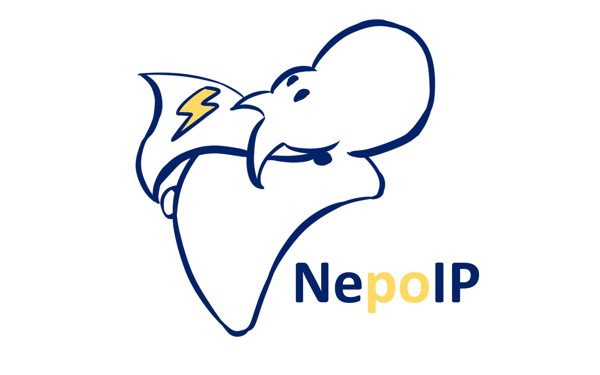

# NepoIP/MM

NepoIP/MM is an open-source code for performing accurate ML/MM MD simulation with electrostatic embedding. 

NepoIP is adapted from the E(3)-equivariant neural network [NequIP](https://github.com/mir-group/nequip).

 

## Installation

### 1. Create Environment

```
conda create -n nepoip-test
```

### 2. Installation of PyTorch

Use the pytorch version that is compatible to your CUDA version, according to [Previous PyTorch Versions | PyTorch](https://pytorch.org/get-started/previous-versions/) . For example, installing with CUDA 12.4 and PyTorch 2.4.1:

```
conda install pytorch==2.4.1 torchvision==0.19.1 torchaudio==2.4.1 pytorch-cuda=12.4 -c pytorch -c nvidia
```

### 3. Installation of OpenMM-Torch

```
conda install -c conda-forge openmm-torch
```

### 4. Installation of NepoIP

The NepoIP model is adapted from the architecture of NequIP, the users are encouraged to go through NequIP's installation instruction and tutorial ([mir-group/nequip: NequIP is a code for building E(3)-equivariant interatomic potentials](https://github.com/mir-group/nequip))

To install NepoIP:

```
git clone https://github.com/Yang-Laboratory/NepoIP.git
cd nepoip
pip install . 
```

### 5. Installation Issues

To check if your installation is working:

* First check if the nequip model is working:

  ```
  $ nequip-train configs/minimal.yaml
  ```

* Next, check if the nepoip model is working:

  ```
  $ nequip-train configs/ala_water_pol_dftb_grad.yaml
  ```

> In the `ala_water_pol_dftb_grad.yaml` configuration file, the specification of `EnergyModel_pol` and `WholeForceOutput` set the use of the nepoip model rather than nequip.

If you suspect something is wrong, encounter errors, or just want to confirm that everything is in working order, you can also run the unit tests:

```
pip install pytest
pytest tests/unit/
```

To run the full tests, including a set of longer/more intensive integration tests, run:

```
pytest tests/
```

If a GPU is present, the unit tests will use it.

### Installation of OpenMM-ML

To perform NepoIP/MM MD simulation, one needs to install our modified version of the openmm-ml package ([openmm/openmm-ml: High level API for using machine learning models in OpenMM simulations](https://github.com/openmm/openmm-ml)):

```
git clone https://github.com/Yang-Laboratory/NepoIP.git
cd openmm-nepoip
pip install . 
```

### Installation Issues

To check if your installation is working:

```
cd nepoip_md/
python example_run.py --traj 1
```

This will run a 2ns NepoIP/MM MD simulation in the NPT ensemble with traj_id=1. The recorded output file `ala_sol_2ns_md_1.out` and the trajectory file `trajectory_1.dcd` should appear in the `example_run/` directory.

## Usage

**! PLEASE NOTE:** the first few calls to a NequIP model can be painfully slow. This is expected behaviour as the [profile-guided optimization of TorchScript models](https://program-transformations.github.io/slides/pytorch_neurips.pdf) takes a number of calls to warm up before optimizing the model. (The `nequip-benchmark` script accounts for this.)

### Basic network training

To train a nequip network, you run `nequip-train` with a YAML config file that describes your data set, model hyperparameters, and training options. 

```bash
$ nequip-train configs/example.yaml
```

In order to train the nepoip model, rather than nequip, the following model_builder should be specified correctly in the YAML config file:

* model_builders: 

  -EnergyModel_pol

  \- WholeForceOutput 

An example YAML is provided to train a nepoip network:

```
$ nequip-train configs/ala_water_pol_dftb_grad.yaml
```

Training runs can also be restarted by running the same `nequip-train` command if the `append: True` option is specified in the original YAML. (Otherwise, a new training run with a different name can be started from the loaded state of the previous run.)

All `nequip-*` commands accept the `--help` option to show their call signatures and options.

### Evaluating trained models (and their error)

The `nequip-evaluate` command can be used to evaluate a trained model on a specified dataset, optionally computing error metrics or writing the results to an XYZ file for further processing.

The simplest command is:
```bash
$ nequip-evaluate --train-dir /path/to/training/session/
```
which will evaluate the original training error metrics over any part of the original dataset not used in the training or validation sets.

For more details on this command, please run `nequip-evaluate --help`.

### Deploying models

The `nequip-deploy` command is used to deploy the result of a training session into a model that can be stored and used for inference.
It compiles a NequIP model trained in Python to [TorchScript](https://pytorch.org/docs/stable/jit.html).
The result is an optimized model file that has no dependency on the `nequip` Python library, or even on Python itself:
```bash
nequip-deploy build --train-dir path/to/training/session/ where/to/put/deployed_model.pth
```
For more details on this command, please run `nequip-deploy --help`.


## References

The paper of NepoIP/MM: 
https://arxiv.org/abs/2502.02801

Users are encouraged to also cite the NequIP model when using NepoIP/MM:
https://www.nature.com/articles/s41467-022-29939-5

## Authors

NepoIP/MM is developed by Ge Song under the supervision of [Prof. Weitao Yang](https://scholars.duke.edu/person/weitao.yang)

